# Fingerprint Nexus Pro - 项目施工图纸

> 🏠 **比喻说明**：将项目视为一栋房屋，从地基到软装进行全方位梳理

---

## 一、地基结构（语言、框架、架构）

```
┌─────────────────────────────────────────────────────────────────────┐
│                        🏠 房屋架构总览                               │
├─────────────────────────────────────────────────────────────────────┤
│                                                                      │
│   表现层：Next.js 16 + React 19                                      │
│   ┌─────────────────────────────────────────────────────────────┐   │
│   │  Next.js App Router + TypeScript + Tailwind CSS v4         │   │
│   │  shadcn/ui 组件库                                           │   │
│   └─────────────────────────────────────────────────────────────┘   │
│                              ↕ API 调用                              │
│   业务层：Next.js API Routes                                        │
│   ┌─────────────────────────────────────────────────────────────┐   │
│   │  API Routes + Prisma ORM + Steel API Client                │   │
│   │  （核心业务逻辑）                                          │   │
│   └─────────────────────────────────────────────────────────────┘   │
│                              ↕ 数据存储                              │
│   数据层：SQLite / PostgreSQL                                       │
│   ┌─────────────────────────────────────────────────────────────┐   │
│   │  Prisma Schema + 12 个数据模型                               │   │
│   │  （数据持久化）                                            │   │
│   └─────────────────────────────────────────────────────────────┘   │
│                                                                      │
└─────────────────────────────────────────────────────────────────────┘
```

### 1.1 技术栈对照表

| 建筑层级 | 技术选型 | 说明 |
|----------|----------|------|
| **地基** | SQLite (开发) / PostgreSQL (生产) | 数据持久化存储 |
| **承重墙** | TypeScript + Next.js 16 | 核心业务逻辑 |
| **水电管线** | Next.js API Routes + Prisma ORM | 数据传输与定时任务 |
| **主框架** | React 19 + App Router | 组件化架构 |
| **外墙装饰** | Tailwind CSS v4 + shadcn/ui | 视觉呈现 |
| **智能家居** | Zustand + TanStack Query | 状态管理 |
| **实时通信** | Socket.IO + Redis Pub/Sub | WebSocket 实时更新 |

---

## 二、房间布局（页面结构）

```
┌─────────────────────────────────────────────────────────────────────────┐
│                      Next.js 单页应用                                   │
├─────────────────────────────────────────────────────────────────────────┤
│                                                                          │
│   ┌──────────────────────────────────────────────────────────────────┐  │
│   │                     src/app/page.tsx (主页面)                     │  │
│   ├──────────┬──────────┬──────────┬──────────┬──────────────────────┤  │
│   │          │          │          │          │                       │  │
│   │ Dashboard│ 指纹管理  │ 模型绑定  │ 定时任务  │ 历史记录             │  │
│   │ (仪表盘)  │ (列表)   │ (配置)   │ (调度)    │ (对比)               │  │
│   │          │          │          │          │                       │  │
│   │ Tab:     │ Tab:     │ Tab:     │ Tab:     │ Tab:                 │  │
│   │ dashboard│ fingerprint│ model  │ scheduler│ history              │  │
│   └──────────┴──────────┴──────────┴──────────┴──────────────────────┘  │
│                                                                          │
│   📍 路由规则：                                                          │
│   ├─ /                                → 主页（单页多模块）              │
│   ├─ /api/fingerprint                 → 指纹管理 API                    │
│   ├─ /api/steel                       → Steel 浏览器会话 API            │
│   ├─ /api/models                      → AI 模型绑定 API                 │
│   ├─ /api/scheduler                   → 定时任务 API                    │
│   └─ /api/history                     → 历史记录 API                    │
│                                                                          │
└─────────────────────────────────────────────────────────────────────────┘
```

---

## 三、核心功能模块（Next.js 实现）

### 3.1 Dashboard 仪表盘

**功能**: 统计数据展示 + 实时日志终端

```typescript
// src/app/page.tsx - Dashboard 模块
const stats = {
  totalFingerprints: number,      // 总指纹数
  activeFingerprints: number,     // 活跃指纹
  naturalizedCount: number,       // 已自然化
  today新增：number,              // 今日新增
}

// 实时更新：WebSocket (Socket.IO)
useRealtime({
  onSystemLog: (log) => updateLogs(log),
  onFingerprint: (fp) => refreshStats(fp),
})
```

**组件**: 
- shadcn/ui Card (统计卡片)
- shadcn/ui Table (数据列表)
- 自定义 Terminal 组件 (日志终端)

---

### 3.2 指纹管理模块

**功能**: 指纹 CRUD + 自然化 + 相似度对比

```typescript
// API 调用
const fingerprints = await api.get('get_all', {}, 'fingerprint')
await api.post('naturalize', { id: fingerprintId }, 'fingerprint')

// 数据采集（DeviceJS）
const collectFingerprint = async () => {
  const res = await fetch('/api/fingerprint?action=collect')
  return res.json()
}
```

**组件**:
- shadcn/ui Dialog (详情模态框)
- shadcn/ui Button (操作按钮)
- shadcn/ui Badge (状态标签)

---

### 3.3 模型绑定模块

**功能**: AI 模型 Token 管理（qwen/zhipu/deepseek/kimi）

```typescript
// Prisma Schema
model ModelBinding {
  id            String   @id @default(cuid())
  fingerprintId String
  modelName     String   // qwen, zhipu, deepseek, kimi
  apiToken      String   // AES 加密存储
  usageCount    Int      @default(0)
}
```

**安全要求**: Token 必须加密存储（AES-256）

---

### 3.4 定时任务模块

**功能**: Cron 表达式调度器 + 自动更新

```typescript
// mini-services/realtime-service
import cron from 'node-cron'

cron.schedule('* * * * *', async () => {
  const jobs = await prisma.schedulerJob.findMany({
    where: { nextRun: { lte: new Date() } }
  })
  // 执行任务...
})
```

---

### 3.5 历史记录模块

**功能**: 指纹快照对比 + 回滚

```typescript
// FingerprintHistory 模型
model FingerprintHistory {
  id            String   @id @default(cuid())
  fingerprintId String
  snapshot      String   // JSON 完整快照
  createdAt     DateTime @default(now())
}

// 相似度计算
const similarity = calculateSimilarity(before, after)
```

---

```
┌─────────────────────────────────────────────────────────────────────────┐
│                              🛋️ 控制台（客厅）                           │
├─────────────────────────────────────────────────────────────────────────┤
│                                                                          │
│  ┌────────────────────────────────────────────────────────────────────┐ │
│  │ 头部区域 (fp-header)                                               │ │
│  │ ├─ Logo 图标 (fp-logo-icon)                                        │ │
│  │ ├─ 标题 "指纹Nexus Pro" (fp-logo-text)                             │ │
│  │ └─ 操作按钮 "立即执行更新" (fp-btn-primary)                         │ │
│  └────────────────────────────────────────────────────────────────────┘ │
│                                                                          │
│  ┌──────────────────────┐  ┌────────────────────────────────────────┐  │
│  │                      │  │                                        │  │
│  │   左侧面板           │  │   右侧面板 - 实时日志终端              │  │
│  │   (fp-left-panel)    │  │   (fp-right-panel)                     │  │
│  │                      │  │                                        │  │
│  │  ┌────────────────┐  │  │  ┌────────────────────────────────┐   │  │
│  │  │ 统计卡片网格   │  │  │  │ 终端头部 (红黄绿点)           │   │  │
│  │  │ (fp-stats-grid)│  │  │  │ fp-terminal-header             │   │  │
│  │  │                │  │  │  └────────────────────────────────┘   │  │
│  │  │ ┌────┬────┐   │  │  │  ┌────────────────────────────────┐   │  │
│  │  │ │总指│活跃│   │  │  │  │                                │   │  │
│  │  │ │纹数│指纹│   │  │  │  │  日志内容区域                 │   │  │
│  │  │ ├────┼────┤   │  │  │  │  (fp-terminal-body)           │   │  │
│  │  │ │自然│今日│   │  │  │  │                                │   │  │
│  │  │ │化  │新增│   │  │  │  │  [时间] LEVEL 消息内容        │   │  │
│  │  │ └────┴────┘   │  │  │  │  [时间] LEVEL 消息内容        │   │  │
│  │  └────────────────┘  │  │  │  ...                           │   │  │
│  │                      │  │  │                                │   │  │
│  │  ┌────────────────┐  │  │  └────────────────────────────────┘   │  │
│  │  │ 快捷操作区     │  │  │                                        │  │
│  │  │ (fp-actions-   │  │  │  🔄 实时轮询更新 (5秒/次)              │  │
│  │  │  grid)         │  │  │                                        │  │
│  │  │                │  │  └────────────────────────────────────────┘  │
│  │  │ ┌────┬────┐   │  │                                              │
│  │  │ │采集│测试│   │  │                                              │
│  │  │ │指纹│Steel│  │  │                                              │
│  │  │ ├────┼────┤   │  │                                              │
│  │  │ │测试│清除│   │  │                                              │
│  │  │ │JS  │日志│   │  │                                              │
│  │  │ └────┴────┘   │  │                                              │
│  │  └────────────────┘  │                                              │
│  │                      │                                              │
│  │  ┌────────────────┐  │                                              │
│  │  │ 定时任务状态   │  │                                              │
│  │  │ (fp-schedule-  │  │                                              │
│  │  │  status)       │  │                                              │
│  │  │                │  │                                              │
│  │  │ 自动更新: ON   │  │                                              │
│  │  │ 更新间隔: 每小时│  │                                              │
│  │  │ 下次执行: 45分钟│  │                                              │
│  │  └────────────────┘  │                                              │
│  │                      │                                              │
│  └──────────────────────┘                                              │
│                                                                          │
└─────────────────────────────────────────────────────────────────────────┘
```

**控制台组件清单：**

| 组件名 | CSS类 | 功能 | 数据来源 |
|--------|-------|------|----------|
| 头部Logo | `.fp-header` | 品牌展示 | 静态 |
| 统计卡片 | `.fp-stat-card` | 显示统计数据 | `FP_DB::get_stats()` |
| 快捷操作 | `.fp-action-btn` | 触发操作 | AJAX调用 |
| 定时状态 | `.fp-schedule-status` | 显示定时任务 | `FP_Scheduler::get_next_run()` |
| 实时终端 | `.fp-terminal` | 日志显示 | 轮询 `fp_get_logs` |
| 采集模态框 | `#fp-collect-modal` | 指纹采集 | 浏览器API |

---

### 3.2 指纹管理页 - 书房

```
┌─────────────────────────────────────────────────────────────────────────┐
│                              📚 指纹管理（书房）                         │
├─────────────────────────────────────────────────────────────────────────┤
│                                                                          │
│  ┌────────────────────────────────────────────────────────────────────┐ │
│  │ 工具栏                                                             │ │
│  │ ├─ 搜索框 (fp-search)                                              │ │
│  │ ├─ 状态筛选 (fp-status-filter)                                     │ │
│  │ └─ "采集新指纹" 按钮                                               │ │
│  └────────────────────────────────────────────────────────────────────┘ │
│                                                                          │
│  ┌────────────────────────────────────────────────────────────────────┐ │
│  │ 数据表格 (fp-table)                                                │ │
│  │ ┌────────┬──────────┬────────┬────────┬────────┬────────────────┐ │ │
│  │ │ 哈希   │ 设备信息  │ 状态   │ 相似度 │ 时间   │ 操作           │ │ │
│  │ ├────────┼──────────┼────────┼────────┼────────┼────────────────┤ │ │
│  │ │ a1b2...│ Win10    │ 活跃   │ ████85%│ 2小时前│ 👁️ 🔄 ↩️ 🗑️  │ │ │
│  │ │ c3d4...│ macOS    │ 活跃   │ ████92%│ 5小时前│ 👁️ 🔄 ↩️ 🗑️  │ │ │
│  │ │ e5f6...│ Linux    │ 已自然化│ ████88%│ 1天前  │ 👁️ 🔄 ↩️ 🗑️  │ │ │
│  │ └────────┴──────────┴────────┴────────┴────────┴────────────────┘ │ │
│  │                                                                     │ │
│  │ 分页控件                                                            │ │
│  │ ◀ 1 2 3 ... 10 ▶                                                   │ │
│  └────────────────────────────────────────────────────────────────────┘ │
│                                                                          │
│  ┌────────────────────────────────────────────────────────────────────┐ │
│  │ 详情模态框 (fp-detail-modal)                                       │ │
│  │ ├─ ID / 哈希 / 状态 / 相似度                                       │ │
│  │ └─ 原始JSON数据查看                                                │ │
│  └────────────────────────────────────────────────────────────────────┘ │
│                                                                          │
└─────────────────────────────────────────────────────────────────────────┘
```

**指纹管理组件清单：**

| 组件名 | CSS类 | 功能 | API调用 |
|--------|-------|------|---------|
| 搜索框 | `.fp-search` | 关键词搜索 | 前端过滤 |
| 状态筛选 | `.fp-select` | 筛选状态 | 前端过滤 |
| 数据表格 | `.fp-table` | 展示指纹列表 | `fp_get_fingerprints` |
| 操作按钮 | `.fp-btn-icon` | 查看/删除/自然化 | `fp_naturalize_fingerprint` |
| 分页 | `.fp-pagination` | 分页导航 | URL参数 `paged` |
| 详情模态框 | `#fp-detail-modal` | 查看详情 | `fp_get_fingerprints` |

---

### 3.3 日志页 - 档案室

```
┌─────────────────────────────────────────────────────────────────────────┐
│                              📁 日志记录（档案室）                       │
├─────────────────────────────────────────────────────────────────────────┤
│                                                                          │
│  ┌────────────────────────────────────────────────────────────────────┐ │
│  │ 日志统计 (fp-log-stats)                                            │ │
│  │ ┌──────────┬──────────┬──────────┬──────────┐                      │ │
│  │ │ 总数: 256│ 错误: 12 │ 警告: 45 │ 今日: 28 │                      │ │
│  │ └──────────┴──────────┴──────────┴──────────┘                      │ │
│  └────────────────────────────────────────────────────────────────────┘ │
│                                                                          │
│  ┌────────────────────────────────────────────────────────────────────┐ │
│  │ 筛选器                                                             │ │
│  │ └─ 级别筛选: [全部 ▼] [信息 ▼] [成功 ▼] [警告 ▼] [错误 ▼]         │ │
│  └────────────────────────────────────────────────────────────────────┘ │
│                                                                          │
│  ┌────────────────────────────────────────────────────────────────────┐ │
│  │ 日志表格 (fp-log-table)                                            │ │
│  │ ┌─────────────────┬────────┬──────────┬─────────────────────────┐ │ │
│  │ │ 时间            │ 级别   │ 类型     │ 消息                    │ │ │
│  │ ├─────────────────┼────────┼──────────┼─────────────────────────┤ │ │
│  │ │ 2024-01-15 10:30│ SUCCESS│ 指纹采集 │ 新指纹已保存           │ │ │
│  │ │ 2024-01-15 10:25│ INFO   │ 定时任务 │ 更新任务开始           │ │ │
│  │ │ 2024-01-15 10:20│ WARNING│ 相似度  │ 相似度低于阈值         │ │ │
│  │ │ 2024-01-15 10:15│ ERROR  │ API     │ Steel连接失败          │ │ │
│  │ └─────────────────┴────────┴──────────┴─────────────────────────┘ │ │
│  │                                                                     │ │
│  │ 分页: ◀ 1 2 3 ... ▶                                                │ │
│  └────────────────────────────────────────────────────────────────────┘ │
│                                                                          │
└─────────────────────────────────────────────────────────────────────────┘
```

---

### 3.4 设置页 - 控制室

```
┌─────────────────────────────────────────────────────────────────────────┐
│                              ⚙️ 系统设置（控制室）                       │
├─────────────────────────────────────────────────────────────────────────┤
│                                                                          │
│  ┌────────────────────────────────────────────────────────────────────┐ │
│  │ API 配置区块                                                       │ │
│  │ ├─ DeviceJS 接口地址: [__________________] [测试连接]              │ │
│  │ ├─ Steel API 地址:   [__________________] [测试连接]              │ │
│  │ └─ Steel API Token:  [__________________]                         │ │
│  └────────────────────────────────────────────────────────────────────┘ │
│                                                                          │
│  ┌────────────────────────────────────────────────────────────────────┐ │
│  │ 更新设置区块                                                       │ │
│  │ ├─ ☑ 启用自动更新                                                 │ │
│  │ ├─ 更新间隔: [每小时 ▼]                                           │ │
│  │ └─ 相似度阈值: ═══════════●═════ 85%                              │ │
│  └────────────────────────────────────────────────────────────────────┘ │
│                                                                          │
│  ┌────────────────────────────────────────────────────────────────────┐ │
│  │ 数据管理区块                                                       │ │
│  │ ├─ 最大指纹数量: [100]                                             │ │
│  │ └─ 数据保留天数: [30]                                              │ │
│  └────────────────────────────────────────────────────────────────────┘ │
│                                                                          │
│  ┌────────────────────────────────────────────────────────────────────┐ │
│  │ 日志设置区块                                                       │ │
│  │ ├─ ☑ 启用日志记录                                                 │ │
│  │ └─ 日志保留天数: [7]                                              │ │
│  └────────────────────────────────────────────────────────────────────┘ │
│                                                                          │
│  ┌────────────────────────────────────────────────────────────────────┐ │
│  │                      [ 保存设置 ]                                   │ │
│  └────────────────────────────────────────────────────────────────────┘ │
│                                                                          │
└─────────────────────────────────────────────────────────────────────────┘
```

---

## 四、水电布线（API 路由与数据流）

### 4.1 Next.js API 路由架构

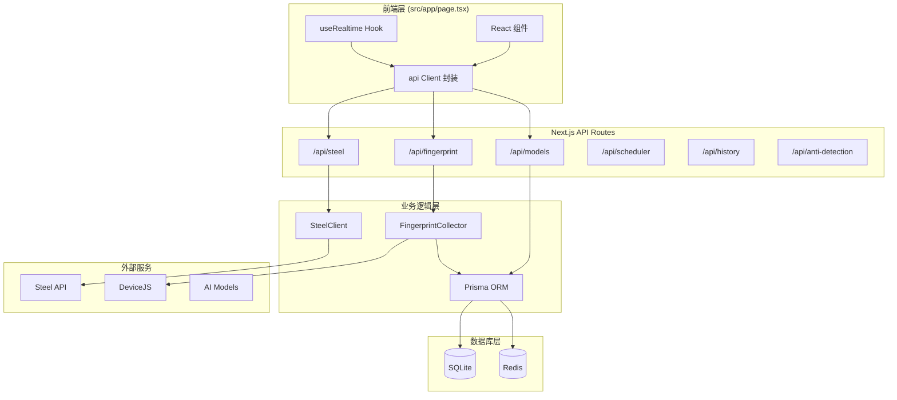

### 4.2 完整 API 路由表

| 端点 | 方法 | 触发页面 | 处理函数 | 返回数据 |
|------|------|----------|----------|----------|
| `/api/fingerprint` | GET/POST | Dashboard/指纹管理 | `handleFingerprint()` | 指纹列表/操作结果 |
| `/api/steel` | GET/POST | Steel 会话管理 | `handleSteelSession()` | 会话信息/QR Code |
| `/api/models` | POST | 模型绑定 | `handleModelBinding()` | 绑定状态 |
| `/api/scheduler` | POST | 定时任务 | `handleScheduler()` | 任务配置 |
| `/api/history` | GET | 历史记录 | `handleHistory()` | 历史快照列表 |
| `/api/anti-detection` | GET | 反检测测试 | `handleAntiDetection()` | 检测报告 |

---

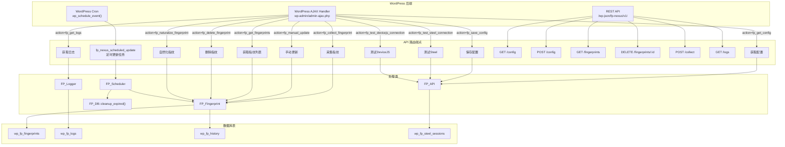

### 4.2 完整 API 路由表

| 端点 | 方法 | 触发页面 | 触发时机 | 处理函数 | 返回数据 |
|------|------|----------|----------|----------|----------|
| `fp_get_config` | AJAX GET | 设置页 | 页面加载 | `FP_API::get_config()` | 配置对象 |
| `fp_save_config` | AJAX POST | 设置页 | 点击保存 | `FP_API::update_config()` | 成功/失败 |
| `fp_collect_fingerprint` | AJAX POST | 控制台 | 采集按钮 | `FP_Fingerprint::save()` | 指纹ID |
| `fp_manual_update` | AJAX POST | 控制台 | 立即更新 | `FP_Fingerprint::batch_update()` | 更新统计 |
| `fp_get_logs` | AJAX GET | 控制台/日志页 | 页面加载/轮询 | `FP_Logger::get_logs()` | 日志列表 |
| `fp_get_fingerprints` | AJAX GET | 指纹管理页 | 页面加载 | `FP_Fingerprint::get_list()` | 指纹列表 |
| `fp_delete_fingerprint` | AJAX POST | 指纹管理页 | 删除按钮 | `FP_Fingerprint::delete()` | 成功/失败 |
| `fp_naturalize_fingerprint` | AJAX POST | 指纹管理页 | 自然化按钮 | `FP_Fingerprint::naturalize()` | 成功/失败 |
| `fp_test_steel_connection` | AJAX POST | 设置页/控制台 | 测试按钮 | `FP_API::test_steel_connection()` | 连接状态 |
| `fp_test_devicejs_connection` | AJAX POST | 设置页/控制台 | 测试按钮 | `FP_API::test_devicejs_connection()` | 连接状态 |

---

## 五、开关控制（WordPress 钩子）

### 5.1 钩子系统架构

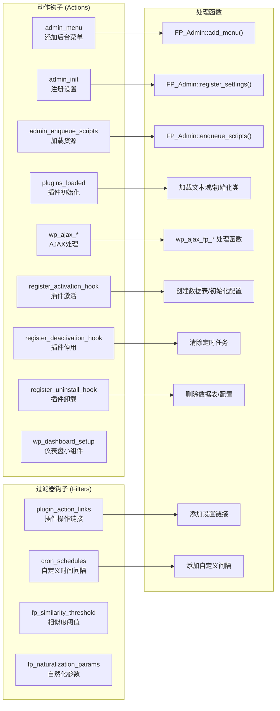

### 5.2 钩子清单

| 钩子名 | 类型 | 文件位置 | 功能 |
|--------|------|----------|------|
| `admin_menu` | Action | class-admin.php | 注册后台菜单 |
| `admin_init` | Action | class-admin.php | 注册设置字段 |
| `admin_enqueue_scripts` | Action | class-admin.php | 加载CSS/JS资源 |
| `plugins_loaded` | Action | fp-nexus-pro.php | 插件主初始化 |
| `wp_ajax_fp_*` | Action | fp-nexus-pro.php | AJAX请求处理 |
| `register_activation_hook` | Action | fp-nexus-pro.php | 激活时建表 |
| `register_deactivation_hook` | Action | fp-nexus-pro.php | 停用时清任务 |
| `register_uninstall_hook` | Action | fp-nexus-pro.php | 卸载时删数据 |
| `wp_dashboard_setup` | Action | class-admin.php | 添加仪表盘组件 |
| `plugin_action_links` | Filter | class-admin.php | 插件列表链接 |
| `cron_schedules` | Filter | class-scheduler.php | 自定义Cron间隔 |

---

## 六、智能家居控制（中继器/装饰器/中台）

### 6.1 中台服务架构

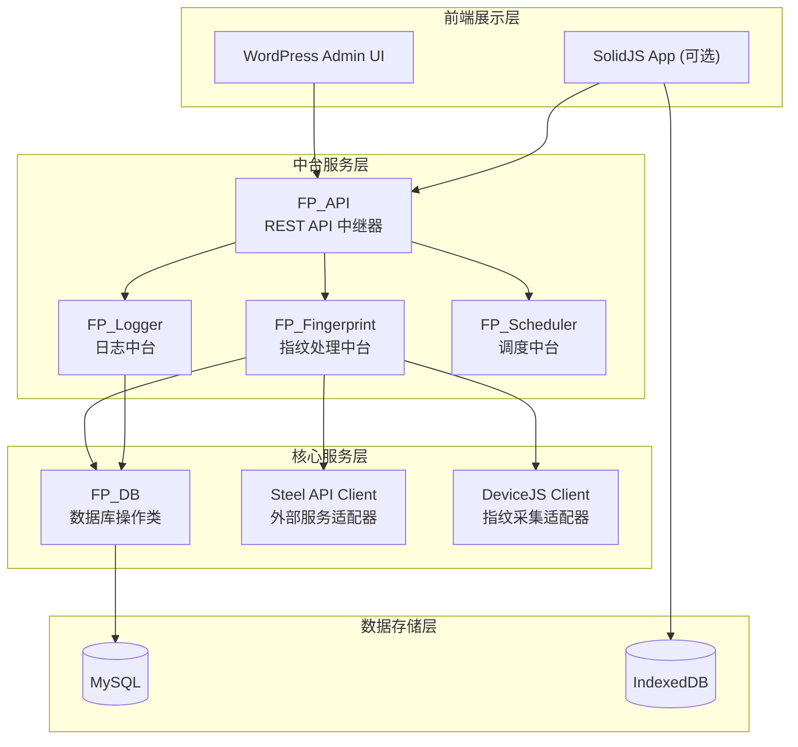

### 6.2 装饰器模式应用

```php
// 指纹自然化装饰器
class FingerprintDecorator {
    private $fingerprint;
    
    public function __construct($fingerprint) {
        $this->fingerprint = $fingerprint;
    }
    
    // 装饰：添加Canvas噪声
    public function withCanvasNoise() {
        $this->fingerprint['canvas'] = $this->addNoise($this->fingerprint['canvas']);
        return $this;
    }
    
    // 装饰：添加Audio噪声
    public function withAudioNoise() {
        $this->fingerprint['audio'] = $this->modulate($this->fingerprint['audio']);
        return $this;
    }
    
    // 装饰：添加WebGL噪声
    public function withWebGLNoise() {
        $this->fingerprint['webgl'] = $this->randomize($this->fingerprint['webgl']);
        return $this;
    }
    
    public function build() {
        return $this->fingerprint;
    }
}

// 使用示例
$naturalized = (new FingerprintDecorator($fp))
    ->withCanvasNoise()
    ->withAudioNoise()
    ->withWebGLNoise()
    ->build();
```

---

## 七、SOP 操作流程

### 7.1 指纹采集完整流程

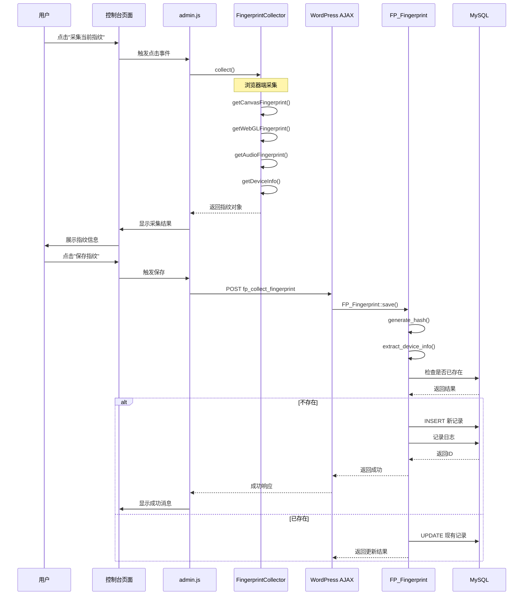

### 7.2 自动更新定时任务流程

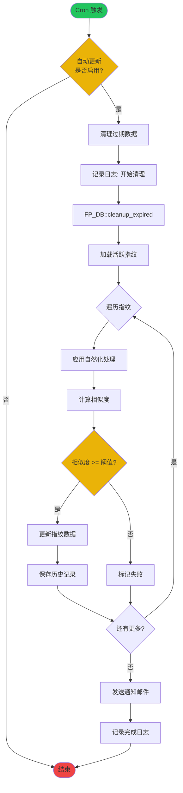

### 7.3 设置保存流程

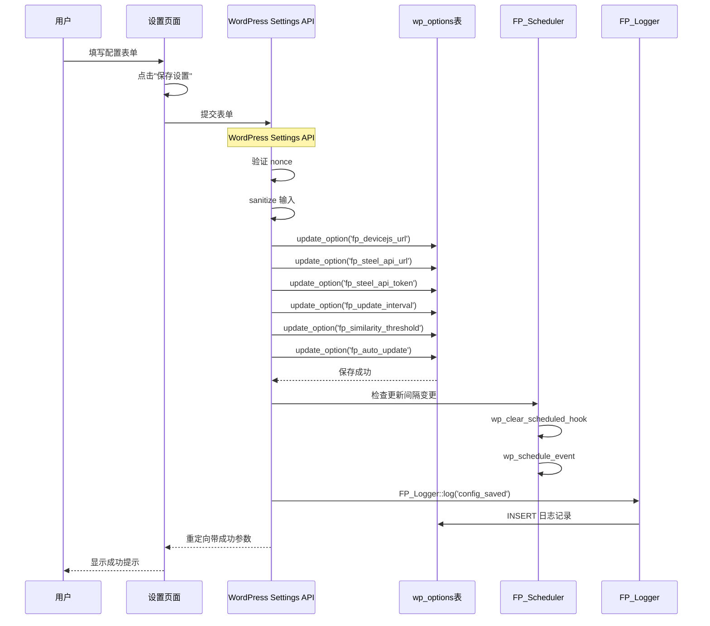

### 7.4 Steel API 调用流程

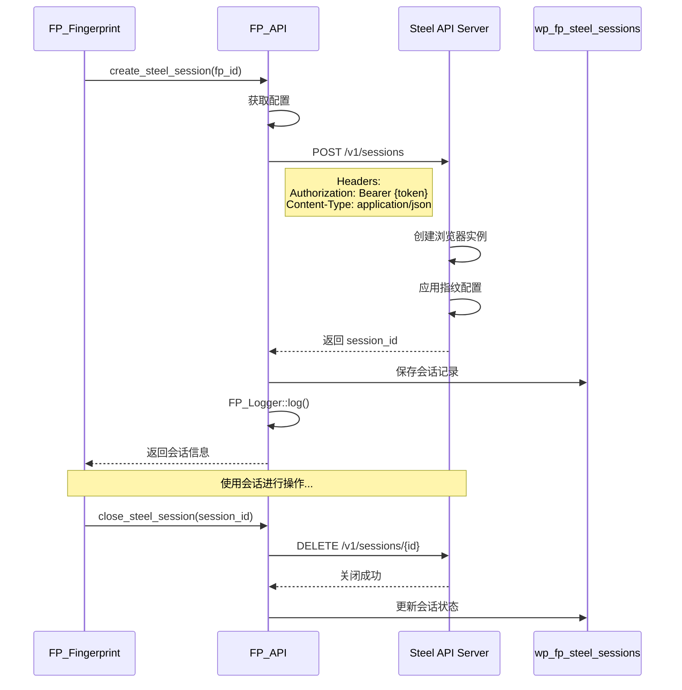

---

## 八、前端交互流程

### 8.1 页面加载流程

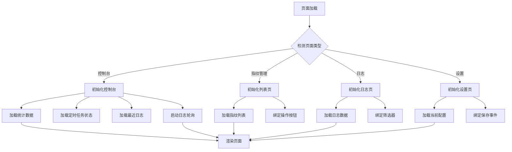

### 8.2 事件绑定关系

```javascript
// 事件绑定映射表
const EventBindings = {
    // 控制台页面
    '#fp-manual-update': {
        event: 'click',
        handler: 'handleManualUpdate',
        api: 'fp_manual_update'
    },
    '#fp-collect-fp': {
        event: 'click',
        handler: 'handleCollectFingerprint',
        flow: ['showModal', 'collect', 'displayResult']
    },
    '#fp-test-steel': {
        event: 'click',
        handler: 'handleTestSteel',
        api: 'fp_test_steel_connection'
    },
    '#fp-clear-terminal': {
        event: 'click',
        handler: 'Terminal.clear'
    },
    
    // 指纹管理页面
    '.fp-btn-delete': {
        event: 'click',
        handler: 'handleDeleteFingerprint',
        api: 'fp_delete_fingerprint',
        confirm: true
    },
    '.fp-btn-naturalize': {
        event: 'click',
        handler: 'handleNaturalizeFingerprint',
        api: 'fp_naturalize_fingerprint',
        confirm: true
    },
    '.fp-btn-view': {
        event: 'click',
        handler: 'showDetailModal'
    },
    
    // 设置页面
    '#fp-save-settings': {
        event: 'submit',
        handler: 'handleSaveSettings',
        redirect: true
    }
};
```

---

## 九、数据流向图

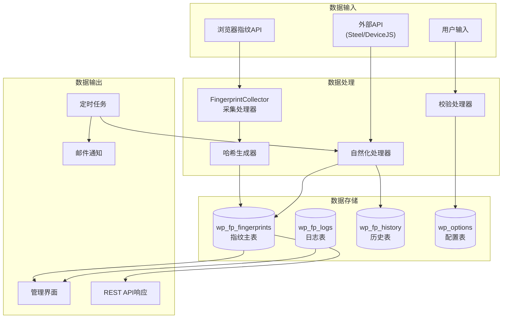

---

## 十、故障排查指南

### 10.1 常见问题流程图

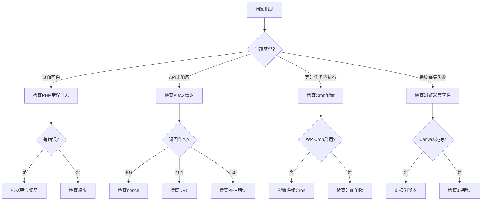

---

## 十一、快速参考卡片

### 11.1 文件定位速查

| 功能 | 文件路径 | 行数参考 |
|------|----------|----------|
| 主入口 | `fp-nexus-pro.php` | 全文件 |
| 数据库建表 | `includes/class-db.php` | 20-80 |
| 后台菜单 | `includes/class-admin.php` | 30-60 |
| REST API | `includes/class-api.php` | 20-150 |
| 指纹处理 | `includes/class-fingerprint.php` | 全文件 |
| 定时任务 | `includes/class-scheduler.php` | 全文件 |
| 控制台模板 | `templates/admin-page.php` | 全文件 |
| 赛博朋克样式 | `assets/css/admin.css` | 全文件 |
| 前端交互 | `assets/js/admin.js` | 全文件 |
| SolidJS入口 | `solid-app/src/App.tsx` | 全文件 |
| DexieJS数据库 | `solid-app/src/stores/db.ts` | 全文件 |

### 11.2 数据库表结构速查

```sql
-- 指纹表
SELECT * FROM wp_fp_fingerprints WHERE status = 'active';

-- 日志表
SELECT * FROM wp_fp_logs ORDER BY created_at DESC LIMIT 50;

-- 历史表（用于回滚）
SELECT * FROM wp_fp_history WHERE fingerprint_id = ?;

-- Steel会话表
SELECT * FROM wp_fp_steel_sessions WHERE status = 'active';
```

---

**文档版本**: v1.0
**更新日期**: 2024-01-15
**适用插件版本**: Fingerprint Nexus Pro v1.0.0
